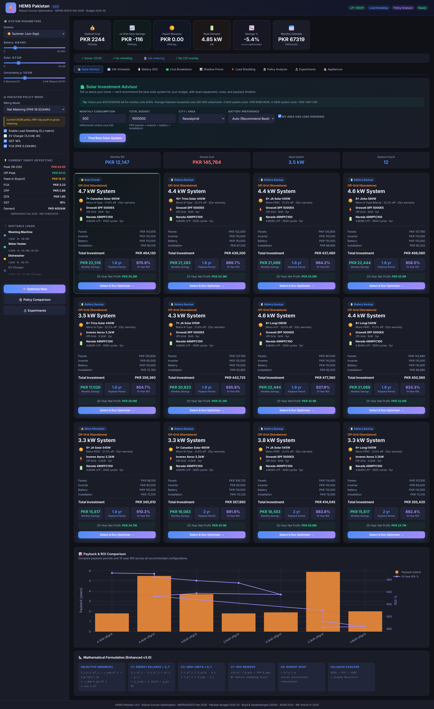
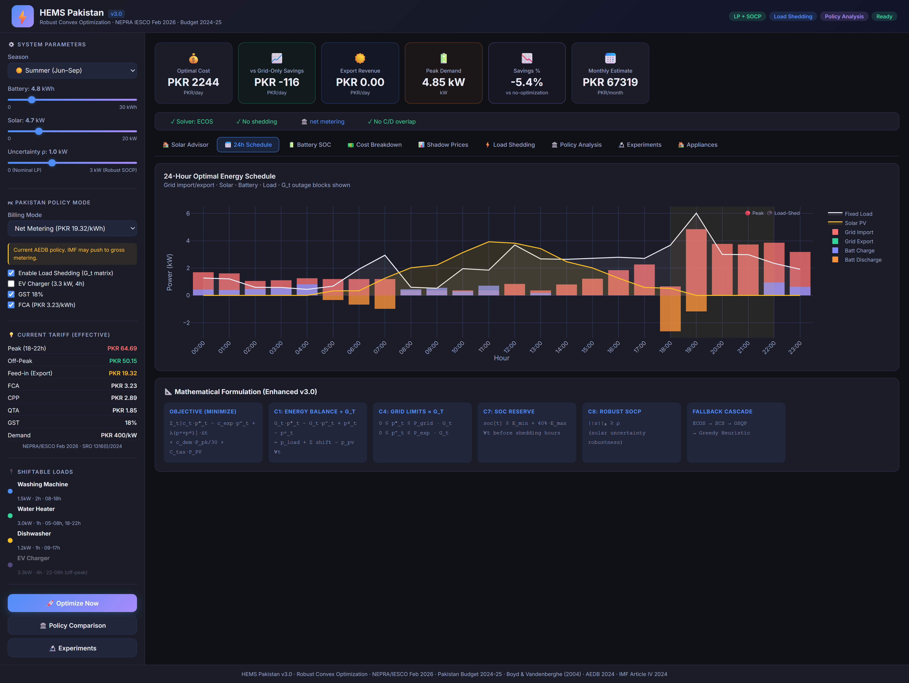
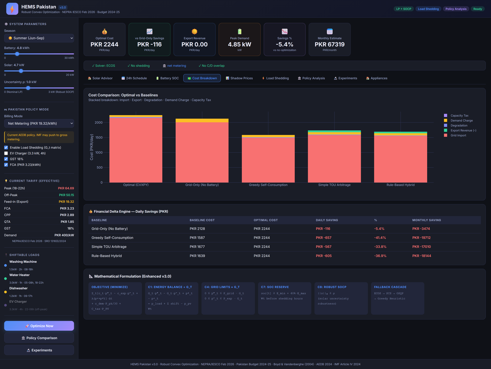
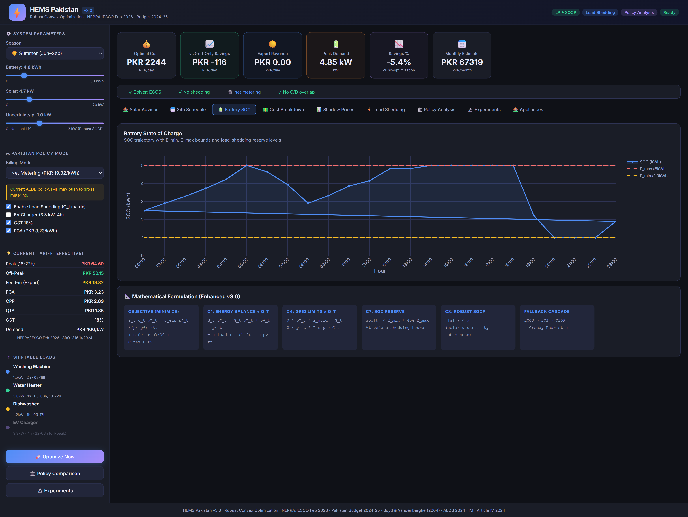
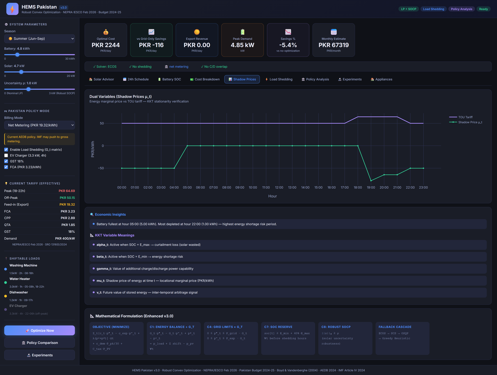
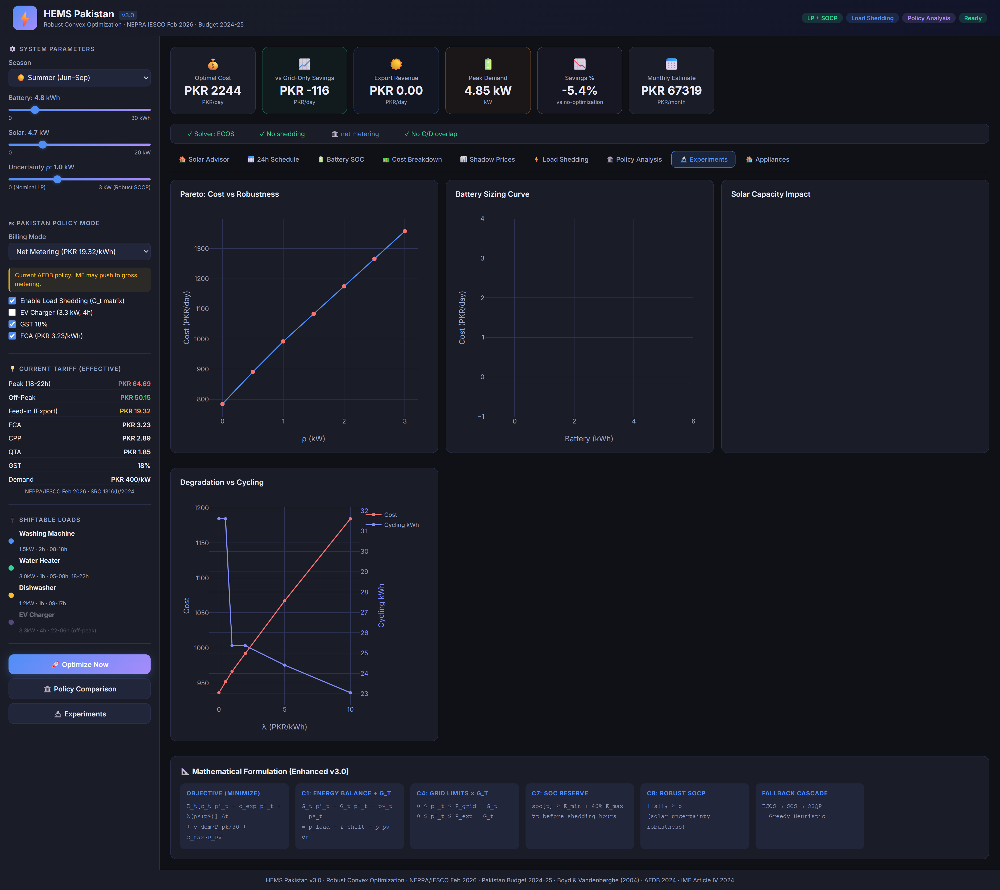

# HEMS Pakistan — Convex Optimization Dashboard v3.0

This project is a Home Energy Management System (HEMS) for Pakistan (NEPRA IESCO Feb 2026 / Budget 2024-25). It uses Convex Optimization (SOCP) with a fallback mechanism to minimize daily energy costs considering load, solar PV generation, and Time-of-Use (TOU) tariffs.

## Features

- **Convex Optimization**: Uses CVXPY and ECOS/SCS to optimize battery scheduling and load management.
- **Robustness**: SOCP (Second-Order Cone Programming) model with a fallback mechanism.
- **Dashboard**: Web-based interactive dashboard built with Flask and Plotly.
- **Hardware Integration**: Optional MQTT hardware control support using Paho-MQTT.

## Installation

1. Clone the repository:
   ```bash
   git clone <your-github-repo-url>
   cd HEMS_Production
   ```

2. Create a virtual environment and activate it:
   ```bash
   python -m venv .venv312
   
   # On Windows
   .\.venv312\Scripts\activate
   
   # On Linux/macOS
   source .venv312/bin/activate
   ```

3. Install the dependencies:
   ```bash
   pip install -r requirements.txt
   ```

4. Set up your environment variables:
   Copy `.env.example` to `.env` and fill in the required parameters.

## Usage

Run the web application:
```bash
python run.py
```
Open your browser and navigate to `http://localhost:5000` to access the dashboard.

## Tech Stack
- **Backend**: Python, Flask, Pandas
- **Optimization**: CVXPY, NumPy, SciPy
- **Visualization**: Plotly, Matplotlib
- **IoT/Hardware**: Paho-MQTT


# ⚡ HEMS — Home Energy Management System

> Robust Convex Optimization for Daily Energy Scheduling with Solar PV, 
> Battery Storage, and Pakistan TOU Tariffs


## What This Does

A Pakistani household with 10 kW solar panels and 13.5 kWh battery pays 
**PKR 15,000–30,000/month** in electricity. This system finds the 
**mathematically optimal** 24-hour energy schedule that:

- ✅ Minimizes daily electricity cost (saves **PKR 2,400–4,000/month**)
- ✅ Handles **load shedding** (3-4 hours daily in Rawalpindi)
- ✅ Protects against **solar uncertainty** via robust optimization
- ✅ Schedules shiftable appliances (washing machine, heater) at cheapest hours
- ✅ Recommends **exact solar equipment** based on budget (Solar Advisor)

## Screenshots

| Solar Advisor | 24h Schedule | Cost Comparison |
|:---:|:---:|:---:|
|  |  |  |

| Battery SOC | Shadow Prices | Experiments |
|:---:|:---:|:---:|
|  |  |  |

## The Math

**Problem Class:** Linear Program (LP) → Second-Order Cone Program (SOCP)

```
minimize  Σ cₜ·pₜ⁺  −  cᵉˣᵖ·Σpₜ⁻  +  λ·Σ(pᶜ+pᵈ)  +  cᵈᵉᵐ·Pₚₖ  +  ρ·‖exposure‖₂
```

- **194 decision variables** (grid import/export, battery charge/discharge, SOC, shiftable loads)
- **9 constraint categories** (energy balance, battery dynamics, SOC limits, load shedding reserve)
- **KKT conditions verified** with dual variable correlation r = 0.92

## Key Results

| Metric | Value |
|--------|-------|
| Optimal daily cost | PKR 768 |
| Savings vs TOU heuristic | 15.1% (PKR 136/day) |
| Solve time (ECOS) | 0.24 seconds |
| Price of robustness (ρ=1.5) | +32.1% |
| Load curtailment during shedding | 1.02 kWh |
| KKT dual-tariff correlation | 0.92 |

## Quick Start

```bash
# Clone
git clone https://github.com/engr-afnan786/HEMS.git
cd HEMS

# Install
pip install -r requirements.txt

# Run academic analysis (generates figures + console results)
python main.py

# Run web dashboard
python run.py
# Open http://localhost:5000
```

## Project Structure

```
HEMS/
├── src/
│   ├── parameters.py      # System parameters, load/solar profiles
│   ├── solver.py          # Nominal LP + Robust SOCP (CVXPY)
│   ├── baselines.py       # 4 heuristic strategies for comparison
│   ├── experiments.py     # 7 parametric sweep experiments
│   ├── visualization.py   # 10 publication-quality figures
│   └── solar_advisor.py   # Equipment recommendation engine
├── backend/
│   ├── app.py             # Flask application factory
│   └── routes/            # API endpoints (optimization, advisor, data)
├── frontend/
│   ├── index.html         # Dashboard UI (9 tabs)
│   ├── js/                # API calls, charts, advisor wizard
│   └── css/               # Dark theme styling
├── main.py                # Academic analysis runner
├── run.py                 # Web server launcher
├── config.py              # Configuration
└── requirements.txt
```

## Features

### 🏠 Solar Investment Advisor
Enter your monthly units and budget → get ranked equipment recommendations 
(JA Solar, Longi, Sungrow, BYD, etc.) with payback period and 25-year ROI.

### 📊 Interactive Dashboard (9 Tabs)
1. **Solar Advisor** — Equipment recommendations with payback calculator
2. **24h Schedule** — Stacked area chart of energy dispatch
3. **Battery SOC** — Charge trajectory with safety bounds
4. **Cost Breakdown** — Optimal vs 4 baselines comparison
5. **Shadow Prices** — Dual variables as real-time price signals
6. **Load Shedding** — Grid availability and backup analysis
7. **Policy Analysis** — Net vs Gross metering vs Capacity Tax
8. **Experiments** — Pareto frontier, battery sizing, sensitivity
9. **Appliances** — Shiftable load Gantt chart

### 🔬 Academic Rigor
- Formal convexity proofs (Propositions 1-2)
- Complete KKT verification (all 4 conditions)
- Solver comparison (ECOS, SCS, CLARABEL)
- 7 limitations discussed with extensions

## Tech Stack

| Component | Technology |
|-----------|-----------|
| Optimization | CVXPY 1.4 + ECOS/SCS/CLARABEL |
| Backend | Python 3.10 + Flask 3.0 |
| Frontend | Vanilla JS + Plotly.js + Chart.js |
| Data | NumPy + SciPy + Matplotlib |
| Report | LaTeX (22-page report included) |

## Pakistan-Specific Features

- **IESCO/NEPRA TOU tariffs** (Feb 2026) with GST + FCA surcharges
- **Load shedding modeling** via grid availability vector G_t ∈ {0,1}
- **Net metering policy** analysis (AEDB 2024)
- **Real equipment database** (28 products with PKR prices)
- **Rawalpindi solar profiles** calibrated to 33.6°N latitude

## Authors

| Name | Role |
|------|------|
| Fahad Ali Aslam Awan (537146) | Formulation, coordination |
| Muhammad Afnan (537042) | KKT analysis, dual interpretation |
| Salman Ahmad (537135) | CVXPY solver, dashboard |
| Omer Zeeshan (536867) | Experiments, baselines |
| Zeeshan Ali (537390) | Testing, documentation |

**Supervisor:** Dr. Javeria Ahmad, NUST (SEECS)
**Course:** Convex Optimization, April 2026

## License

MIT License — see [LICENSE](LICENSE) file.
```
